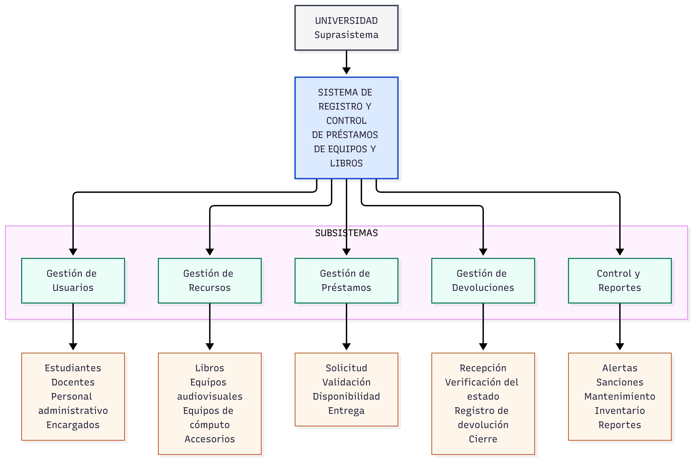
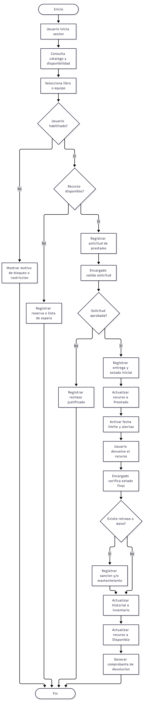
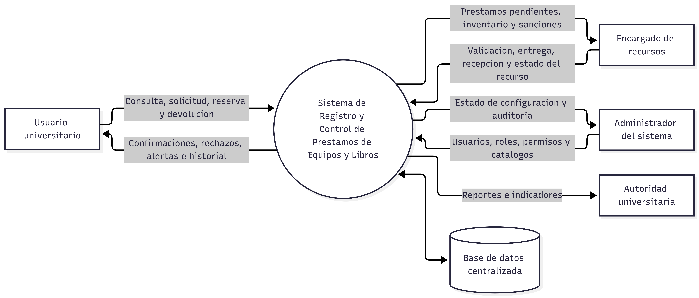
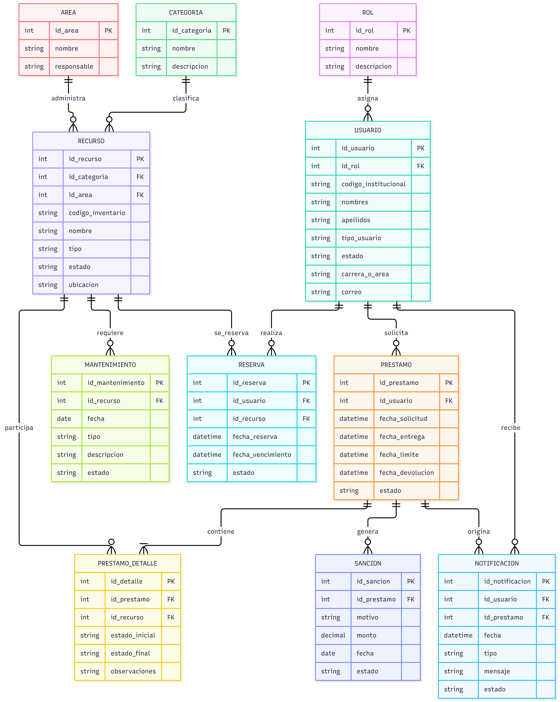
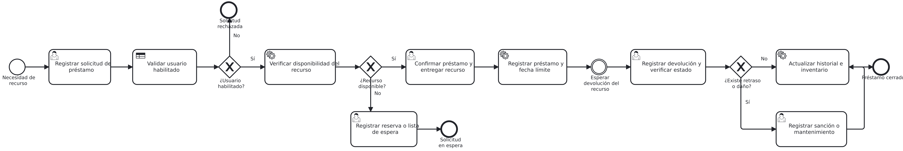

# Prestamos Universidad

Modulo Odoo para el registro, control y seguimiento de prestamos de libros, equipos audiovisuales, equipos de computo y otros recursos universitarios.

El modulo esta orientado a una universidad que necesita centralizar solicitudes, entregas, devoluciones, sanciones, mantenimiento, inventario y reportes operativos.

## Acceso al sistema

La instancia publicada del sistema se encuentra en:

[https://odoo.appsbolivia.com/](https://odoo.appsbolivia.com/)

Credenciales de demostracion:

| Dato | Valor |
| --- | --- |
| Usuario | `grupo2` |
| Contrasena | `Grupo2_123` |

> Estas credenciales son de uso academico o demostrativo. Para produccion se recomienda cambiarlas y asignar permisos segun el rol real de cada usuario.

## Objetivo del modulo

El objetivo del modulo es reemplazar registros manuales o planillas aisladas por un flujo integrado dentro de Odoo. El sistema permite:

- Registrar recursos prestables de la universidad.
- Clasificar recursos por categoria y area responsable.
- Validar usuarios con perfil universitario.
- Crear solicitudes de prestamo.
- Confirmar y entregar recursos.
- Registrar devoluciones.
- Detectar atrasos, danos o perdidas.
- Registrar sanciones y mantenimientos.
- Consultar reportes y dashboard operativo.

## Usuarios y roles

El modulo contempla tres grupos principales:

| Grupo | Uso esperado |
| --- | --- |
| Estudiante | Consulta recursos, crea solicitudes y revisa su historial. |
| Docente | Solicita recursos academicos o audiovisuales para clases e investigacion. |
| Administrador / Encargado | Gestiona inventario, prestamos, devoluciones, sanciones, mantenimiento y reportes. |

## Menu principal

Al abrir la aplicacion **Prestamos Universidad**, el sistema muestra directamente el **Dashboard de prestamos universitarios**.

Desde el menu superior se accede a:

- **Operaciones**
  - Prestamos
  - Devoluciones y atrasos
  - Sanciones
  - Mantenimiento
- **Catalogos**
  - Usuarios / Perfiles
  - Recursos
- **Reportes**
  - Dashboard
  - Prestamos activos
  - Prestamos atrasados
  - Recursos mas prestados
  - Disponibilidad de recursos
  - Sanciones pendientes
- **Configuracion**
  - Categorias
  - Areas responsables

## Dashboard

El dashboard es la pantalla principal del modulo. Presenta tarjetas clicables con indicadores operativos:

- Total de recursos
- Recursos disponibles
- Recursos prestados
- Recursos en mantenimiento
- Prestamos activos
- Prestamos vencidos
- Sanciones pendientes
- Usuarios con prestamos

Cada tarjeta abre el reporte filtrado correspondiente. Las zonas libres del dashboard no ejecutan acciones, para evitar aperturas accidentales.

## Flujo principal de uso

1. El usuario o encargado ingresa a **Prestamos Universidad**.
2. Se revisa la disponibilidad de recursos.
3. Se crea una solicitud de prestamo.
4. El encargado confirma la solicitud.
5. El encargado registra la entrega fisica del recurso.
6. El sistema mantiene el prestamo como activo hasta la devolucion.
7. Al devolver el recurso, se registra el estado final.
8. Si existe atraso, dano o perdida, se genera una sancion.
9. Si el recurso requiere revision, se registra mantenimiento.
10. Los reportes muestran disponibilidad, prestamos activos, atrasos y sanciones.

## Recursos y data inicial

El modulo incluye data inicial para una demostracion universitaria:

- Areas responsables:
  - Biblioteca Central
  - Laboratorio de Sistemas
  - Unidad de Audiovisuales
  - Laboratorio de Redes
  - Gabinete de Computacion
  - Laboratorio de Electronica
  - Almacen Universitario
- Categorias:
  - Libros academicos
  - Tesis y trabajos de grado
  - Manuales tecnicos
  - Laptops
  - Tablets
  - Proyectores
  - Camaras y video
  - Audio y sonido
  - Equipos de redes
  - Kits de electronica
  - Accesorios de computo
- Recursos de ejemplo:
  - Libros de sistemas, bases de datos, redes y metodologia
  - Tesis y manuales tecnicos
  - Laptops y tablets
  - Proyectores
  - Camaras y microfonos
  - Routers y switches
  - Kits de electronica
  - Accesorios para presentaciones

## Reportes incluidos

### Prestamos activos

Muestra prestamos confirmados o entregados. Permite controlar que recursos estan en proceso y que usuario los tiene asignados.

### Prestamos atrasados

Muestra prestamos marcados como atrasados. Sirve para seguimiento de devoluciones vencidas y aplicacion de sanciones.

### Recursos mas prestados

Agrupa lineas de prestamo por recurso, categoria y area. Ayuda a identificar los recursos con mayor demanda.

### Disponibilidad de recursos

Muestra recursos disponibles, prestados, en mantenimiento o no disponibles. Es util para control operativo diario.

### Sanciones pendientes

Muestra sanciones activas por atraso, dano, perdida u otros motivos.

## Modelos principales

| Modelo | Descripcion |
| --- | --- |
| `prestamo.recurso` | Recursos prestables: libros, equipos y accesorios. |
| `prestamo.categoria` | Clasificacion de recursos por tipo. |
| `prestamo.area` | Area responsable del recurso. |
| `prestamo.prestamo` | Cabecera del prestamo. |
| `prestamo.prestamo.line` | Detalle de recursos entregados en un prestamo. |
| `prestamo.sancion` | Sanciones por atraso, dano, perdida u otros motivos. |
| `prestamo.mantenimiento` | Control de mantenimiento de recursos. |
| `prestamo.dashboard` | Indicadores y accesos directos del tablero principal. |
| `res.users` | Extension de usuarios con perfil universitario. |

## Instalacion local

1. Copiar el modulo en el directorio de addons de Odoo:

   ```text
   server/addons/prestamos_universidad
   ```

2. Reiniciar el servicio de Odoo.

3. Activar modo desarrollador.

4. Actualizar la lista de aplicaciones.

5. Buscar e instalar:

   ```text
   Prestamos Universidad
   ```

6. Si ya estaba instalado, actualizar el modulo para cargar nuevos datos, vistas y assets.

## Dependencias

El modulo depende de:

```python
['base', 'mail']
```

`mail` se usa para chatter, seguimiento y actividades en modelos como prestamos, recursos, sanciones y mantenimientos.

## Estructura del modulo

```text
prestamos_universidad/
├── data/
│   └── prestamos_universidad_data.xml
├── docs/
│   └── images/
├── models/
│   ├── prestamo_area.py
│   ├── prestamo_categoria.py
│   ├── prestamo_dashboard.py
│   ├── prestamo_mantenimiento.py
│   ├── prestamo_prestamo.py
│   ├── prestamo_recurso.py
│   ├── prestamo_sancion.py
│   └── res_users.py
├── security/
│   ├── ir.model.access.csv
│   └── prestamos_universidad_security.xml
├── static/
│   ├── description/
│   │   └── icon.png
│   └── src/
│       └── scss/
│           └── prestamo_dashboard.scss
├── views/
│   ├── prestamo_area_views.xml
│   ├── prestamo_categoria_views.xml
│   ├── prestamo_mantenimiento_views.xml
│   ├── prestamo_prestamo_views.xml
│   ├── prestamo_recurso_views.xml
│   ├── prestamo_reportes_views.xml
│   ├── prestamo_sancion_views.xml
│   ├── prestamos_universidad_menus.xml
│   └── res_users_views.xml
├── __init__.py
└── __manifest__.py
```

## Diagramas del sistema

Los siguientes diagramas resumen el analisis y diseno del sistema.

### Diagrama jerarquico



### Diagrama de proceso



### DFD nivel 0



### Modelo entidad relacion



### Proceso BPMN



## Actualizacion del modulo

Despues de modificar codigo, vistas o assets:

1. Reiniciar Odoo.
2. Actualizar el modulo `prestamos_universidad`.
3. Refrescar el navegador con `Ctrl + F5`.
4. Si los estilos no se actualizan, abrir Odoo con:

   ```text
   ?debug=assets
   ```

## Estado del proyecto

El modulo cuenta con:

- Menus funcionales.
- Icono de aplicacion.
- Data inicial universitaria.
- Dashboard principal.
- Reportes operativos.
- Modelos de prestamos, recursos, sanciones y mantenimiento.
- Seguridad por grupos.
- Documentacion para GitHub.
